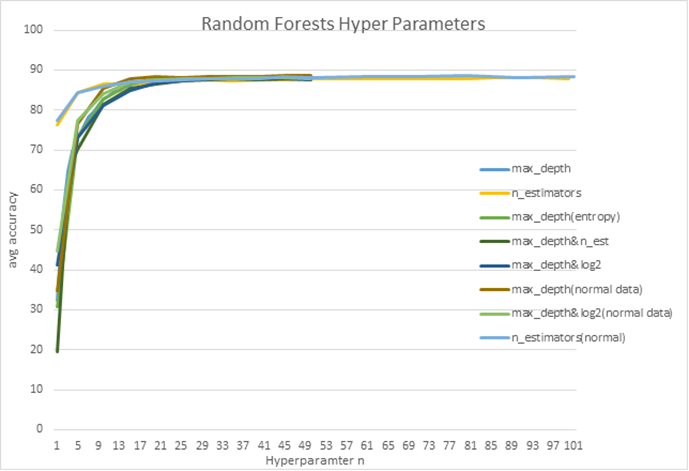
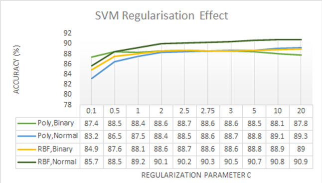

# fashMNIST
Testing and comparing different machine learning algorithms and their hyperparameters on the fashion MNIST dataset. Not a complete list of what was tested as it was part of an iterative development

Algorithm Selection

The 3 algorithms I have chosen to test Fashion-MNIST on are: Naïve Bayes, Random Forests and
SVM. I chose these algorithms as they each classify data differently. I chose to test Naïve Bayes to
see how a probabilistic classifier performs for image classification as its typically intended
probabilistic variables and not pixel postion data. I chose Random Forests to see how an ensemble
learning method performs on the dataset and to see the effect of the number of trees had. SVM
was chosen to see how well the data could be separated and to see the effects of overfitting. The
hyperparameters selected for Naive Bayes where the different event models; Categorical,
Gaussian, Complement, Bernoulli and Multinomial. As they assume distribution of features
differently and individually Laplace smoothing had no effect on performance. For Random Forests I
explored the effect the number of trees had on performance, the functions to measure the quality
of a split in the tree (Gini impurity and entropy/information gain), max features (square root features
or log2 features) and max depth of the tree. For SVM, I tested the different kernel functions as they
separated the data differently and the regularisation parameter to see if the margins were being
overfit and if they could be improved upon.

Methodology

To measure and test performance the algorithms learnt to fit the training set with the correct labels,
then they were predicted against the testing set without the labels. These sets were split by the
data set creators. Precision recall and F-1 score for each class (0-9) were collected, as well as an
average of the entire prediction. They each represent different interpretations of accuracy so a
combined average of all these results is used as main measurement of the overall accuracy of the
prediction. The collection of precision recall and f1-score for each class also enabled me to explore
how accuracy ranged over the classes and the different scores. The dataset was initially Binarized
to increase speed and improve performance, but I was concerned how it might affect accuracy so
used to it find optimal or best parameters and test further and compare it with the accuracy of the
raw data set. To optimise parameters, if capable, for example with Random Forests, they were
iteratively tested as well as tested in conjunction with other parameters. I also tested how the best
performing of each parameter worked together. I also tested the default parameters as a
comparison, to find out if they were necessary or optimal as the performance could plateau and
waste computation time and resources. In some cases where an iterative testing was deemed too
computationally long to find i.e., for SVM, the regulation parameter was optimised by seeing how a
range of larger and smaller values would improve performance, then the values in-between was
tested till an optimal value was found. For Naïve Bayes, the Laplacian smoothing had no effect on
accuracy, so the different event models were tested with and without binarizing the data.

Results

With Naïve Bayes, as Laplacian smoothing had no effect on accuracy the only results that were
recorded were the average accuracy for each event model. Categorical could not give results for
the normal data set, however performed the best alongside Bernoulli for the binarized set: 71.4%.
Bernoulli uses binary data and will convert normal data, so has been omitted as it will perform the
same for both. Multinomial then gives the best accuracy for the normal data set:66.7%. Multinomial
and Complement naïve bayes decreases in accuracy with binarized, complement NB is expected
to follow suite as it is an adaption of multinomial NB suited for imbalanced data sets. Gaussian
Distribution increases in accuracy with binary data.

|Average Accuracy             |
|-----------------------------|
|NB Model    | normal| binary |
|------------|-------|--------|
|Categorical | N/A   |   71.  |
|Gaussian    | 59.1  |   66.  |
|Complement  | 60.7  |   56   |
|Bernoulli   | N/A   |   71.  |
|Multinomial | 66.7  |   59.  |

With Random Forests I wanted to establish which
parameters have greater effect on the accuracy and
what their optimal values are. I established
comparison accuracies using default parameters and
with some parameters changed, e.g., criterion, max
features. And conjunction of the highest accuracies of
max depth and n estimators (no. trees). I also plotted
the results of the parameters that were iterable (max
depth, n estimators). We can see the accuracy for all
parameters plateau at around 88% with 0.5%
deviation, binarizing the data, the criterion and max features have no considerable effect. From the
graph we can see that the number of trees has less effect on the accuracy than the depth of the
trees. However, from the tests optimal parameters can be established; max_depth of the trees
being 40 and n_estimator of 85 trees. Using these optimal parameters has the potential of having a
better time complexity and better use of resources in comparison to using the default values
especially for estimators. Binarizing the data has no considerable effect on accuracy but has a
better time to compute.

With SVM, I established using binary data which out of
the 4 kernels (Radial Basis function RBF, SVCLinear,
Polynomial, Sigmoid) performed better. Sigmoid had
considerably lower accuracy whilst RBF and Poly got
similar accuracies throughout the different classes and
measurements and an average accuracy variance of
0.3%. Using only RBF and Poly kernel SVM, I optimised
the regularisation parameters for both binary and
normal data, 1 being the default parameter. The poly kernel was used to get a range of testing
parameters hence why the parameters are not uniform. The poly kernel with binarized data has a
max of 88.7% at C=2, with normal data it has a max of 89.3% with C=20. RBF with binary data has
a max of 89% at C=20. With normal data it has a max of 90.9% at C=20 also. From the graph we
can see there is a plateau for all 4 at C=2-5. From the graph it shows that with the normal dataset
and RBF kernel, SVM at its default values of 1 overfits and benefits from a higher regularisation
parameter, showing that RBF & C=20 with the normal data set are the optimal parameters.

Conclusion

Naïve Bayes performed considerably worse than SVM and random forests by 16.6%, whilst SVM
and random forest performed very similarly of around 88%, however with proper optimisation the
regularisation parameter and using the right Kernels i.e., RBF or Poly, you can achieve higher
accuracies of 89-90.9%. With Random Forests the parameters reached a plateau of 88% where no
change to data or parameters has no effect, however we were able to optimise the parameters to
max depth= 40 and n estimators being 85, which could improve time complexity and resource use
whilst giving the same results as the default parameters. With Naïve Bayes Laplacian smoothing
had no effect but using different event models we were able to improve performance to 71.4%. I
think SVM gave the highest accuracy as how the kernel functions can learn to separate the
classes, having a choice of kernels that separate the data in varying different ways and being able
to adjust the overfitting of the hyperplanes with the regularisation parameter. It gives you more
chance to improve upon the results. RBF groups classes into radial clusters, where polynomial
kernel tries to fit the hyper plane around the classes. Due to this RBF tends to be more closely
“fitting”. Naïve Bayes gives the worst as it predicts classes based off the probability distribution of
pixel positions. Random Forests is a close competitor to SVM though, with how decision trees work
it is a good choice for the data set. As several of the classes like Bags, sandals and sneakers are
more unique looking where T-shirt/top, shirts, pullovers are more similar looking and are often
misclassified, which seems to be a limiting factor on the accuracy of the methods even though a
high accuracy can be learnt.
